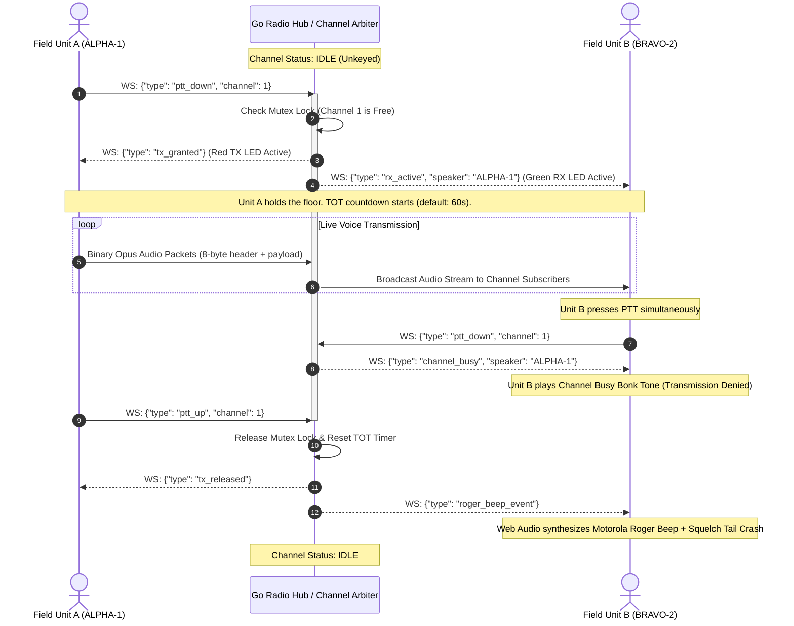

# Go Two-Way Radio / Tactical RoIP Server

A real-time, low-latency, multi-channel **Two-Way Radio (Push-To-Talk / Walkie-Talkie)** server written in **Go (Golang)**. Features authentic half-duplex floor control, Web Audio synthesizer (Roger beeps & squelch tail), **Telegram-inspired Dark UI** with vector SVG icons, **Mapbox Tactical GPS Radar Map**, **WebRTC Video & Screen Sharing**, and **File/Image Attachments with Upload Speed Tracking**.

---

## System Architecture

```mermaid
flowchart TD
    subgraph Clients["Field Clients & Terminals"]
        BrowserA["Desktop Browser / Mobile Client<br/>(Callsign: ALPHA-1)"]
        BrowserB["Tactical Field Terminal<br/>(Callsign: BRAVO-2)"]
        HardwareRoIP["Hardware Transceiver / ESP32<br/>(RoIP UDP Client)"]
    end

    subgraph Ingress["Ingress & Edge Routing"]
        Cloudflare["Cloudflare Edge Tunnel<br/>(HTTPS & WSS Secure Proxy)"]
        DirectPort["Direct Port Listener<br/>(TCP 8080 / UDP 5005)"]
    end

    subgraph GoServer["Go Two-Way Radio Server Engine"]
        HTTPRouter["HTTP & Static Asset Server<br/>(//go:embed HTML / CSS / JS)"]
        WSHub["WebSocket Client Hub<br/>(Signaling & Audio Router)"]
        FloorController["Channel Floor Controller<br/>(Half-Duplex Mutex & TOT Engine)"]
        RoIPEngine["RoIP UDP Bridge<br/>(Hardware Audio Gateway)"]
        UploadStorage["Media Storage Engine<br/>(/api/upload & Static Store)"]
    end

    subgraph RealTimeP2P["Real-Time Peer Mesh"]
        WebRTC["WebRTC Video & Screen Share Mesh"]
    end

    BrowserA <-->|WSS / HTTPS| Cloudflare
    BrowserB <-->|HTTP / WS| DirectPort
    HardwareRoIP <-->|Raw UDP Audio Packets| DirectPort

    Cloudflare --> HTTPRouter
    Cloudflare --> WSHub
    DirectPort --> HTTPRouter
    DirectPort --> WSHub
    DirectPort --> RoIPEngine

    WSHub <--> FloorController
    RoIPEngine <--> FloorController
    HTTPRouter --> UploadStorage

    BrowserA <.-.->|P2P Tactical Video Stream| WebRTC
    BrowserB <.-.->|P2P Tactical Video Stream| WebRTC
```

---

## Half-Duplex Floor Control & PTT Sequence



---

## Key Features

### Tactical Voice Communications
- **Authentic Half-Duplex Floor Control**: Only one radio unit can transmit per channel at a time. Other units receive a busy lock warning tone if they attempt to transmit simultaneously.
- **Time-Out-Timer (TOT)**: Prevents hot mics from jamming channels indefinitely (configurable, default 60s).
- **Web Audio Synthesizer (Zero External Audio Assets)**:
  - **Roger Beeps**: Classic Motorola 2-tone, NASA Apollo Quindar tone (2475 Hz), CB radio chirp, or silent squelch.
  - **Squelch Tail**: FM discriminator static noise crash on unkey.
  - **Mic Key-Up Chirp**: Low-latency pre-tone on PTT key-down.
  - **Alert Siren**: 1750 Hz emergency alarm tone with animated visual flashers.
- **Voice Chat 2.0 Hero Stage**: Glowing Telegram-style voice orb with pulse rings and dynamic 3-bar animated soundwave indicators for active speakers.
- **Instant Replay Buffer**: Click `REPLAY` to immediately listen back to the last received transmission.
- **Hardware VU Modulation Meter**: Hardware-style segmented LED bar meter reacting in real-time to microphone audio.

### Telegram-Inspired Dark UI (Zero-Emoji Design)
- **Telegram Aesthetic**: Dark slate palette (`#0e1621` background, `#17212b` sidebar, `#242f3d` surface cards, `#2b5278` active channel accents).
- **Crisp Vector SVGs**: 100% SVG vector icon system across all UI elements, HUD notifications, radar pins, and modal drawers. Zero raw emojis.
- **Chat & Transcripts**: Telegram message bubbles with deterministic author callsign colors, timestamps, and delivered double-check marks (`✓✓`).
- **Composer Pill**: Modern pill input with attachment quick-menu, upload speed indicators, and circular paper-plane send action.

### Mapbox GL Tactical GPS Radar
- **Live Satellite & Dark Mapbox GL Integration**: Real-time tactical map showing all field units.
- **Beacon Positioning**: Auto-detects device GPS coordinates, heading, altitude, and broadcast speed.
- **Unit Telemetry**: Battery status, signal strength, callsign tags, and direct messaging links.
- **Tactical Sweep Radar**: Overlay drawer with radar reticle sweep animation.

### WebRTC Video & Screen Sharing
- **Peer-to-Peer Tactical Video**: Broadcast camera feeds or desktop screens directly to channel members.
- **Picture-in-Picture Drawer**: Draggable, resizable tactical video feed modal.

### Multimedia Attachments & Transfer Telemetry
- **File & Image Sharing**: Send photos, field schematics, audio, and documents.
- **Real-Time Transfer Speed & Progress**: Upload speed counter (KB/s, MB/s), percentage bar, and thumbnail previews before broadcast.

### Cloud & Embedded Hardware Ready
- **Single Static Binary**: The entire frontend is compiled into the Go executable via `//go:embed static/*`. No external web server or node runtime needed.
- **RoIP UDP Bridge**: Optional UDP socket listener for hardware radios, ESP32 microcontrollers, or Raspberry Pi field kits.
- **Cloud-Ready**: Dynamic `$PORT` binding for Railway, Render, Fly.io, Heroku, Docker, and Cloudflare Tunnels.

---

## Quick Start

### 1. Native Go (Local)

**Prerequisites**: Go 1.21+

```bash
# Clone the repository
git clone https://github.com/Heng-zm/server-Two-way-radio.git
cd server-Two-way-radio

# Build executable
go build -o twowayradio.exe ./cmd/server

# Run server
./twowayradio.exe
```

Open your browser at **`http://localhost:8080`**.

---

### 2. Docker & Docker Compose

Run with container isolation:

```bash
docker compose up -d --build
```

Access the web interface at **`http://localhost:8080`**.

---

### 3. Deploy to Railway

This repository is optimized for [Railway](https://railway.com/) and similar cloud PaaS platforms:

1. Create a new service on Railway connected to your GitHub repository.
2. Railway detects the `Dockerfile` and builds the static Linux binary.
3. The server automatically binds to Railway's dynamic `$PORT` environment variable.
4. Set the Healthcheck path in your Railway Service settings to **`/healthz`**.

---

### 4. Public HTTPS Tunnel (Cloudflare)

To test over public internet or mobile devices with HTTPS microphone permissions:

```bash
cloudflared tunnel --url http://localhost:8080
```

---

## Controls & Keybindings

| Key / Action | Function |
|---|---|
| <kbd>Spacebar</kbd> (Hold) | Push-to-Talk (Transmit) |
| Click & Hold **PUSH TO TALK** | Mobile touch-and-hold PTT |
| <kbd>M</kbd> | Toggle Mute Microphone |
| <kbd>1</kbd> - <kbd>8</kbd> | Quick switch channels 1 through 8 |
| <kbd>S</kbd> | Toggle Scan Mode (monitors all channels) |
| <kbd>R</kbd> | Replay last received transmission |
| <kbd>E</kbd> | Broadcast emergency alert tone |

---

## Environment Variables & CLI Flags

The server can be configured via command-line flags or environment variables:

| Flag | Env Variable | Default | Description |
|---|---|---|---|
| `-port` | `PORT` | `8080` | HTTP & WebSocket server port |
| `-udp` | `UDP_PORT` | `5005` | RoIP UDP audio listener port (`0` to disable) |
| `-tot` | `TOT_SECONDS` | `60` | Push-to-Talk Time-Out-Timer in seconds |

Example:
```bash
./twowayradio.exe -port 9090 -tot 45 -udp 0
```

---

## REST & WebSocket API

### HTTP Endpoints
- `GET /healthz` : Server healthcheck endpoint (returns HTTP 200 `OK`).
- `GET /api/channels` : List channel frequencies, subscriber counts, and busy states.
- `GET /api/status` : Server uptime, memory metrics, and client statistics.
- `POST /api/upload` : Multipart file upload endpoint for chat attachments.
- `GET /uploads/{filename}` : Static file delivery for media attachments.

### WebSocket Interface (`/ws?callsign=<CALLSIGN>`)
- **Signaling Frames (JSON)**:
  - `join_channel`: Switch channel subscription.
  - `ptt_down` / `ptt_up`: Floor request arbitration.
  - `chat_message`: Text and file attachment distribution.
  - `gps_beacon`: Tactical coordinate and telemetry broadcasts.
  - `webrtc_offer` / `webrtc_answer` / `webrtc_ice`: Video & screen share negotiation.
- **Audio Stream (Binary)**:
  - 8-byte framing header `[0x52, 0x41, channel_id, flags, seqNum]` followed by raw Opus-encoded audio packets.

---

## Project Structure

```
.
├── cmd/
│   └── server/
│       └── main.go              # Application entry point, CLI flags, & HTTP router
├── internal/
│   ├── config/
│   │   └── config.go            # Channels, default frequencies, and CTCSS tones
│   ├── radio/
│   │   ├── channel.go           # Channel floor control, TOT, & subscriber state
│   │   ├── channel_test.go      # Unit tests for floor arbitration & TOT timeouts
│   │   ├── client.go            # WebSocket read/write pumps & rate limiting
│   │   ├── hub.go               # Packet router, message broker, & client registry
│   │   └── protocol.go          # Wire protocol types & binary audio header packing
│   ├── roip/
│   │   └── udp_server.go        # UDP Radio-over-IP hardware bridge
│   └── web/
│       ├── embedded.go          # embed.FS static asset packager
│       └── static/
│           ├── index.html       # Single-page tactical console UI
│           ├── css/
│           │   └── radio.css    # Telegram dark theme, radar HUD, and layout
│           └── js/
│               ├── audio.js     # AudioContext microphone pipeline & VU meter
│               ├── radio.js     # WebSocket controller, Mapbox GL, WebRTC & chat
│               └── sounds.js    # Synthesized Roger beeps, Quindar, & squelch audio
├── .dockerignore                # Container build context filter
├── Dockerfile                   # Multi-stage container definition
├── docker-compose.yml           # Local containerized orchestration
├── go.mod                       # Go module dependencies
├── go.sum                       # Go checksum lockfile
└── README.md                    # Documentation
```

---

## License

MIT License. Free for open-source, amateur radio, and commercial development.